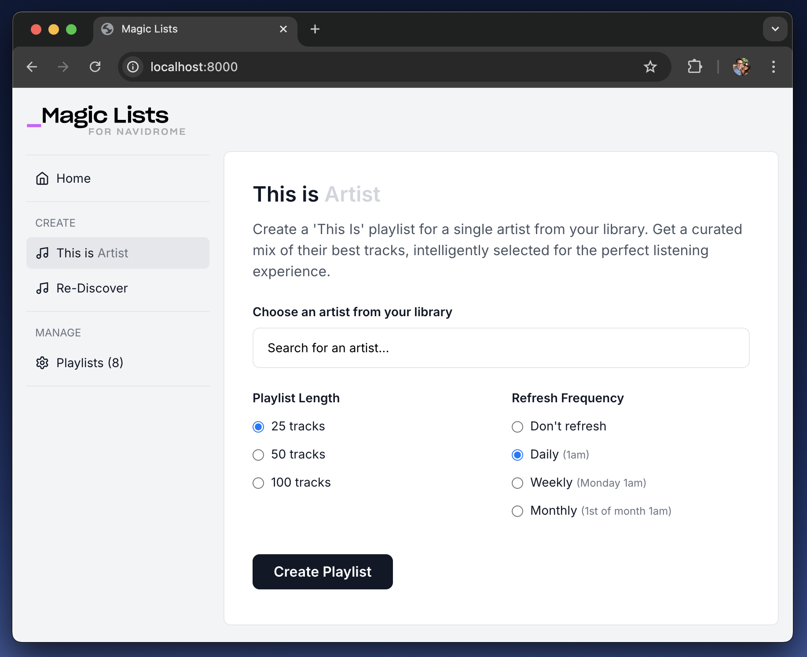

# MagicLists for Navidrome

**AI-assisted playlists for your own music library.**

MagicLists adds the kind of curated, evolving playlists you'd expect from Spotify
or Apple Music — except it runs entirely against your self-hosted
[Navidrome](https://www.navidrome.org/) server. No subscriptions, no renting your
music back. Just smart mixes generated from the library you already own.

> **This is the winterbottom.xyz fork** of
> [rsynnot/magic-lists-for-navidrome](https://github.com/rsynnot/magic-lists-for-navidrome).
> It tracks the upstream app but is maintained to run as a first-party service on
> winterbottom.xyz infrastructure: published as a multi-arch GHCR image, gated
> behind Microsoft Entra ID when public, styled with the shared design system, and
> held to the [repo standards](standards/REPO-STANDARDS.md). See
> [What's different in this fork](#whats-different-in-this-fork).

---

## Contents

- [What it does](#what-it-does)
- [Radio, in detail](#radio-in-detail)
- [What's different in this fork](#whats-different-in-this-fork)
- [Running it on winterbottom.xyz infra](#running-it-on-winterbottomxyz-infra)
- [Running it anywhere else](#running-it-anywhere-else)
- [Configuration reference](#configuration-reference)
- [AI providers](#ai-providers)
- [System check page](#system-check-page)
- [API endpoints](#api-endpoints)
- [Development](#development)
- [Troubleshooting](#troubleshooting)
- [License and credits](#license-and-credits)

---

## What it does

| Playlist | What you get |
| --- | --- |
| 🎵 **This Is (Artist)** | A definitive playlist for any artist in your library — hits, deep cuts and featured appearances, without duplicates. |
| 📻 **Radio** | A station seeded from an artist *or* a song: similar-style tracks from your own library, plus albums worth buying by fitting artists you don't own yet. [Details below](#radio-in-detail). |
| 🎸 **Genre Mix** | A curated mix drawn from a whole genre in your collection. |
| 🔄 **Re-Discover** | Rotates tracks you haven't played in a while, so the collection keeps surprising you. |

Every playlist is written to Navidrome as a real, playable playlist (with the
curator's write-up stored as the playlist comment), and can be set to refresh
**daily, weekly or monthly** — or rebuilt on demand with the **Recreate** button.



*Creating a "This Is (Artist)" playlist*

---

## Radio, in detail

Radio is the headline feature of this fork. It answers "play me more like this"
using only what's on your own server, and tells you honestly when your library
can't do it.

### Seeding a station

Pick **an artist** from your library, or **search for a song** and seed from that.
Choose a length (25 / 50 / 100 tracks) and, optionally, a refresh frequency. The
station is named after the seed (`Dan Mangan Radio`) unless you name it yourself.

### How a station gets built

1. **Gather a candidate pool** ([`backend/radio.py`](backend/radio.py)) — each
   step only runs while the pool is still thin, so one good source short-circuits
   the rest:
   1. **Similar songs** via Subsonic `getSimilarSongs2` — a Last.fm-backed,
      library-resident pool of the seed artist plus similar artists, in one call.
   2. **The seed artist's own tracks**, so the seed is guaranteed to be present.
   3. **Backfill from similar artists' catalogues** (up to 12 artists).
   4. **Genre fallback** on the seed's primary genre, to broaden a thin pool.

   The pool is capped at 800 tracks. Steps 3 and 4 also fire when the pool has
   enough *tracks* but too few distinct *artists* — otherwise a deep-catalogue
   artist with no library neighbours would quietly yield a single-artist station.

2. **Smart-filter for the model** — the pool is scored on engagement (play
   counts, recency, loved/starred tracks) and trimmed so the LLM payload stays
   affordable. On a library with little play history, part of the set is drawn at
   random instead, so play counts don't just describe which corner of the library
   you happen to have visited.

3. **Curate** — the [`radio_v1_001`](recipes/radio_v1_001.json) recipe asks the
   model to select for style coherence first, then popularity, then release-year
   spread; open with two or three recognisable tracks; never repeat an artist
   back-to-back or an album consecutively; and cap any single artist at 20% of
   the station.

4. **Enforce the rules in code** — a model can't be relied on for a hard
   guarantee, so the constraints are applied after the fact:
   - **Seed-artist cap** — the seed may hold at most 20% of the station (a
     station is "artists like X", not a greatest-hits of X). Dropped tracks are
     backfilled from the pool rather than simply lost.
   - **Seed goes first** — a station seeded from a song opens with that song; one
     seeded from an artist opens with that artist. If the curator dropped the
     seed entirely, it's pulled back in from the pool.
   - **Per-artist cap** — enforced by dropping, never by padding: a thin library
     yields a genuinely short station rather than a padded one.

5. **Report the gap** — if the station came up short, the UI says so in plain
   language ("Only 14 of the 25 tracks you asked for — your library ran out of
   similar-style music to draw on"), along with how many candidates matched. A
   *full-length* station built from a degraded pool is reported too: if the
   similar-songs lookup failed and the station was rebuilt from a fallback, it
   will look much like the last one, and you're told rather than left guessing.

### Albums you don't own yet

Alongside the tracklist, Radio suggests 3–5 albums by fitting artists that are
**not** in your library — the point being to show you exactly what to buy to make
the next station better.

- **Grounded in Last.fm.** When `LASTFM_API_KEY` is set, the suggestions are
  drawn from Last.fm's similar-artist graph minus everything already in your
  library, so the names are real and genuinely absent. Without Last.fm, the model
  falls back to its own knowledge.
- **One click to Lidarr.** Set `LIDARR_URL` and each suggestion becomes a deep
  link into Lidarr's *Add New* search, prefilled with the artist and album.
  Unset, they render as plain text.

### Keeping a station fresh

- **Scheduled refresh** — daily / weekly / monthly. The seed is stored as
  `radio:{seed_type}:{seed_id}`, so a refresh regenerates the station from the
  same seed against your current library.
- **Recreate** — rebuild now from the playlist management screen, optionally
  changing the length or schedule at the same time. It reuses the scheduler's own
  refresh path, so a manual rebuild and an automatic one produce identical
  results — including the seed-first and seed-cap rules.
- **How it was last built** is kept with the playlist and shown in the UI, so a
  short or degraded station stays explainable after the fact.

### Tuning it

The station's shape lives in two places: the constants at the top of
[`backend/radio.py`](backend/radio.py) (`MAX_CANDIDATE_TRACKS`,
`MAX_SIMILAR_ARTISTS`, `MIN_POOL_BEFORE_BACKFILL`, `SEED_ARTIST_SHARE`) and the
recipe JSON in [`recipes/radio_v1_001.json`](recipes/radio_v1_001.json). Recipes
are versioned and selected through [`recipes/registry.json`](recipes/registry.json),
so a new curation prompt lands as a new file rather than an edit in place.

---

## What's different in this fork

Everything below is additive to upstream — the app still runs standalone on a
LAN exactly as it always did.

**Deployment**

- **Published to GHCR** as `ghcr.io/davidwinterbottom-2/magic-lists-for-navidrome`
  on every push to `main`, tagged `:latest` (for Watchtower to follow) and with
  the commit SHA (for traceability and rollback).
- **Multi-arch** — `linux/amd64` *and* `linux/arm64`, because the deployment
  target is a Raspberry Pi.
- **`docker-compose.yml` runs the registry image** rather than a local build, so
  Watchtower can see a new digest; `MAGICLISTS_VERSION` pins a specific build for
  rollback. Building from source is still one flag away (`--build`).

**Security**

- **Microsoft Entra ID (Azure AD) OIDC login gate**, off by default. The app
  holds your Navidrome credentials and AI key server-side, so it must not be
  reachable anonymously once it's on the public internet.
- **`HOSTING-SECURITY.md` is deliberately not vendored here.** This repo is
  public and that document describes private infrastructure; read it from the
  [`devcontainer-sandbox`](https://github.com/DavidWinterbottom-2/devcontainer-sandbox)
  template instead.
- **Analytics are self-hosted.** Upstream reported to a third-party Umami
  instance; this fork sends nothing unless you point `ANALYTICS_SCRIPT_URL` and
  `ANALYTICS_WEBSITE_ID` at an Umami you run.

**Features**

- **Radio** — the whole feature, including library-gap reporting and album
  suggestions ([above](#radio-in-detail)).
- **Last.fm integration** — loved tracks boost scoring in every playlist type,
  Radio's album suggestions are grounded in the similar-artist graph, and
  Re-Discover gains a Last.fm fallback. Status is surfaced on the system-check
  page. Entirely optional.
- **Recreate button** plus a stored **build record**, so you can see how a
  playlist was last built and rebuild it on demand.
- **Fixed repeated candidate selection** — selection no longer returns the same
  tracks every time on a library with sparse play history.

**Repo hygiene** (per [REPO-STANDARDS](standards/REPO-STANDARDS.md))

- Shared **winterbottom design system** (`winterbottom.css` +
  `winterbottom-theme.js`, §8) with light/dark theming.
- **Devcontainer** templated off `devcontainer-sandbox` (§7), plus the shared
  Claude Code skills library and an automated **template sync** workflow that
  opens a PR when a vendored skill or standards doc drifts.
- **CI** (lint + tests on every PR), a **per-PR version gate** with
  `pyproject.toml` as the version source (§2), and an **MIT LICENSE** (§6).

---

## Running it on winterbottom.xyz infra

This app is a **first-party deployed service**: the image is built here, and
`docker-infra` consumes it. The service directory in `docker-infra` holds only the
deployment — compose file, `Makefile`, README and `.env.example` — while the
application, its CI and its versioning live in this repo.

### 1. The image

Pushing to `main` runs [`publish.yml`](.github/workflows/publish.yml), which
cross-builds `linux/amd64` + `linux/arm64` under QEMU and pushes:

```
ghcr.io/davidwinterbottom-2/magic-lists-for-navidrome:latest
ghcr.io/davidwinterbottom-2/magic-lists-for-navidrome:sha-<commit>
```

There is no per-release version tag on the image: a `:latest` service is
versioned by its image SHA, which is how you identify and pin what's actually
running. `workflow_dispatch` rebuilds without an empty commit (e.g. after a
base-image CVE).

### 2. The service directory

Add a service under `docker-infra/home-docker/services/magiclists/` following the
first-party web-app pattern:

- **`Makefile`** — set `SERVICE_NAME` / `SERVICE_PORT` (plus any of the optional
  knobs) and `include ../service-common.mk`. Don't hand-roll the targets; the
  shared include gives you the standard set —
  `help · install · start · stop · restart · logs · status · health · clean · pull · config`.
- **`docker-compose.yml`** — use [this repo's compose file](docker-compose.yml)
  as the starting point. The parts that matter:

  ```yaml
  services:
    magiclists:
      image: ghcr.io/davidwinterbottom-2/magic-lists-for-navidrome:${MAGICLISTS_VERSION:-latest}
      container_name: magiclists
      ports:
        - "4545:4545"
      env_file:
        - .env
      environment:
        - DATABASE_PATH=/app/data/magiclists.db
      volumes:
        - magiclists_data:/app/data
      restart: unless-stopped
      labels:
        # Opt in explicitly, so a --label-enable Watchtower only touches what it should
        - "com.centurylinklabs.watchtower.enable=true"
      healthcheck:
        test: ["CMD", "curl", "-f", "http://localhost:4545/health"]
        interval: 30s
        timeout: 10s
        start_period: 10s
        retries: 3

  volumes:
    magiclists_data:
      driver: local
  ```

  The container listens on **4545** (not 8000 — that's an upstream-era detail
  still floating around older docs). `/app/data` must be a persistent volume:
  it holds the SQLite database with your playlists and schedules.

- **`.env`** — copy [`.env.example`](.env.example) and fill it in. Never commit
  it; commit the example instead.

### 3. Wire it up

**Navidrome connection.** Put MagicLists on the same Docker network as Navidrome
and address it by container name:

```bash
NAVIDROME_URL=http://navidrome:4533
NAVIDROME_USERNAME=...
NAVIDROME_PASSWORD=...
```

**Require login before it's public.** MagicLists holds your Navidrome credentials
and AI key server-side, so the moment it's reachable from the internet the Entra
gate must be on:

```bash
AUTH_DISABLED=false
AZURE_TENANT_ID=consumers          # or your tenant GUID
AZURE_CLIENT_ID=...
AZURE_CLIENT_SECRET=...
ALLOWED_EMAILS=you@example.com     # comma-separated; empty = anyone in the tenant
SESSION_SECRET=<long random value>  # set it, so logins survive a restart
```

With `AUTH_DISABLED=false` and the credentials missing, **the app refuses to
start** rather than coming up unprotected. When the gate is on, every route needs
a session except `/health`, `/auth/*` and the PWA shell (`/static/*`,
`/manifest.webmanifest`, `/sw.js`, `/offline.html`); API calls without one get a
`401`, browsers get redirected to Microsoft.

In Azure, add a **Web** redirect URI of
`https://<your-subdomain>.winterbottom.xyz/auth/callback`. This uses the same
environment-variable convention as the other winterbottom.xyz apps, so the
existing app registration can be reused — just add the extra redirect URI.

**Analytics (optional).** Point both variables at your own Umami instance; set
neither and nothing is collected:

```bash
ANALYTICS_SCRIPT_URL=https://<your-umami>/script.js
ANALYTICS_WEBSITE_ID=00000000-0000-0000-0000-000000000000
```

**Integrations (optional).** `LASTFM_API_KEY` + `LASTFM_USERNAME` sharpen
curation; `LIDARR_URL` turns Radio's album suggestions into one-click adds.

### 4. Deploy, verify, roll back

```bash
make install      # first run: creates data dirs, checks required env
make start
make health       # or: curl -f http://<host>:4545/health
make logs
```

Then open the app and check **`/system-check`** — it validates the Navidrome URL,
credentials and API access, the AI provider, library configuration and Last.fm,
with a specific suggestion for anything that fails.

Watchtower picks up new `:latest` digests automatically. To pin or roll back, set
the SHA tag and restart:

```bash
MAGICLISTS_VERSION=sha-<commit>   # in .env
make pull && make restart
```

---

## Running it anywhere else

The app is fine on a trusted LAN or Tailscale network with the auth gate left off
(`AUTH_DISABLED` unset ⇒ disabled).

### Alongside your existing Navidrome compose stack

Recommended: same network as Navidrome, so the connection is simple and reliable.

```yaml
services:
  navidrome:
    # ... your existing Navidrome config ...

  magiclists:
    image: ghcr.io/davidwinterbottom-2/magic-lists-for-navidrome:latest
    container_name: magiclists
    ports:
      - "4545:4545"
    environment:
      - NAVIDROME_URL=http://navidrome:4533
      - NAVIDROME_USERNAME=your_username
      - NAVIDROME_PASSWORD=your_password
      - DATABASE_PATH=/app/data/magiclists.db
      - AI_PROVIDER=openrouter
      - AI_API_KEY=your_api_key
      - AI_MODEL=meta-llama/llama-3.3-70b-instruct
    volumes:
      - ./magiclists-data:/app/data
    restart: unless-stopped
```

```bash
docker compose up -d
```

Then open <http://localhost:4545>. If your Navidrome service has a different
container name, change `NAVIDROME_URL` to match.

### Standalone container

```bash
docker run -d \
  --name magiclists \
  -p 4545:4545 \
  -e NAVIDROME_URL=http://192.168.1.100:4533 \
  -e NAVIDROME_USERNAME=your_username \
  -e NAVIDROME_PASSWORD=your_password \
  -e DATABASE_PATH=/app/data/magiclists.db \
  -e AI_PROVIDER=openrouter \
  -e AI_API_KEY=your_api_key \
  -v ./magiclists-data:/app/data \
  ghcr.io/davidwinterbottom-2/magic-lists-for-navidrome:latest
```

Pick the right `NAVIDROME_URL` for where Navidrome lives:

| Navidrome is… | Use |
| --- | --- |
| on the same Docker network | `http://navidrome:4533` |
| on the same host | `http://host.docker.internal:4533` (Docker Desktop) or `http://172.17.0.1:4533` (Linux) |
| elsewhere on the LAN | `http://192.168.1.100:4533` |
| public | `https://music.yourdomain.com` |

### From source

```bash
git clone https://github.com/DavidWinterbottom-2/magic-lists-for-navidrome.git
cd magic-lists-for-navidrome
pip install -r requirements.txt
cp .env.example .env       # then edit it
python -m uvicorn backend.main:app --host 0.0.0.0 --port 4545
```

For local development use `DATABASE_PATH=./magiclists.db`. To update, `git pull`
and restart.

---

## Configuration reference

Full annotated list in [`.env.example`](.env.example).

**Required**

| Variable | Notes |
| --- | --- |
| `NAVIDROME_URL` | Base URL of your Navidrome server |
| `NAVIDROME_USERNAME` / `NAVIDROME_PASSWORD` | MagicLists logs in and manages its own token |
| `DATABASE_PATH` | `/app/data/magiclists.db` in Docker (on a mounted volume), `./magiclists.db` standalone. **Required** — playlist creation fails with a 500 without a writable path |

**AI curation** (optional — without it, playlists fall back to play-count ordering)

| Variable | Notes |
| --- | --- |
| `AI_PROVIDER` | `openrouter`, `groq`, `google` or `ollama` |
| `AI_API_KEY` | Not needed for Ollama |
| `AI_MODEL` | Provider defaults apply if unset |
| `OLLAMA_BASE_URL` / `OLLAMA_TIMEOUT` | Ollama only; raise the timeout on slow CPUs |

**Integrations** (optional)

| Variable | Notes |
| --- | --- |
| `LASTFM_API_KEY` / `LASTFM_USERNAME` | Loved-track scoring and grounded Radio suggestions. Needs Settings → Privacy → "Hide recent listening information" **off** |
| `LIDARR_URL` | Turns Radio album suggestions into Lidarr *Add New* links |
| `NAVIDROME_LIBRARY_ID` | Target one library; leave empty to use all of them |
| `LOG_LEVEL` | `ERROR` / `INFO` / `DEBUG` |

**Deployment** (optional)

| Variable | Notes |
| --- | --- |
| `MAGICLISTS_VERSION` | Image tag to run; `latest` (default) is what Watchtower follows, `sha-<commit>` pins a build |
| `ANALYTICS_SCRIPT_URL` / `ANALYTICS_WEBSITE_ID` | Both must be set, or nothing is collected. Point at an Umami **you** run |
| `AUTH_DISABLED`, `AZURE_*`, `ALLOWED_EMAILS`, `SESSION_SECRET`, `OIDC_REDIRECT_URI`, `SESSION_HTTPS_ONLY` | The Entra login gate — see [above](#3-wire-it-up) |

### Multiple Navidrome libraries

MagicLists detects and works across all libraries by default. Set
`NAVIDROME_LIBRARY_ID` to target one; the system-check page reports which
configuration is in effect.

---

## AI providers

Any OpenAI-compatible provider below works; without one, MagicLists falls back to
play-count and metadata ordering.

**OpenRouter** — [openrouter.ai](https://openrouter.ai) ($5 minimum)

```bash
AI_PROVIDER=openrouter
AI_API_KEY=sk-or-v1-your-key-here
AI_MODEL=deepseek/deepseek-chat          # free tier
```

**Google AI** — [ai.google.dev](https://ai.google.dev/) (free, no card)

```bash
AI_PROVIDER=google
AI_API_KEY=AIzaSy_your-google-key-here
AI_MODEL=gemini-2.5-flash
```

**Groq** — [console.groq.com](https://console.groq.com/) (free, no card)

```bash
AI_PROVIDER=groq
AI_API_KEY=gsk_your-groq-key-here
AI_MODEL=llama-3.1-8b-instant
```

**Ollama** — local models, see [OLLAMA_SETUP.md](OLLAMA_SETUP.md)

```bash
AI_PROVIDER=ollama
AI_MODEL=llama3.2
OLLAMA_BASE_URL=http://localhost:11434/v1/chat/completions
# In Docker: http://host.docker.internal:11434/v1/chat/completions
OLLAMA_TIMEOUT=300                       # raise for slower CPUs (default 180)
```

Radio in particular benefits from a capable model — style coherence is a
judgement call the fallback ordering can't make.

---

## System check page

Configuration is validated on startup, and you can revisit it any time at
`/system-check`. It reports:

- **Environment variables** — required values present
- **Navidrome URL** — server reachable
- **Navidrome authentication** — credentials valid
- **Navidrome artists API** — API access working
- **AI provider** — configured and reachable
- **Library configuration** — single vs multiple libraries
- **Last.fm integration** — key valid, username readable (never fails the page;
  it's optional)

Each failure comes with a specific suggestion.

---

## API endpoints

Interactive docs at `/docs`, schema at `/openapi.json`.

| Method | Path | Purpose |
| --- | --- | --- |
| `GET` | `/` | Web interface |
| `GET` | `/health` | Liveness probe (unauthenticated) |
| `GET` | `/system-check` | Configuration diagnostics page |
| `GET` | `/api/health-check` | Diagnostics as JSON |
| `GET` | `/api/artists` | Artists from Navidrome |
| `GET` | `/api/genres` | Genres from Navidrome |
| `GET` | `/api/songs?q=` | Song search (Radio seed) |
| `GET` | `/api/music-folders` | Configured libraries |
| `POST` | `/api/create_radio_playlist` | Build a Radio station from an artist or song seed |
| `POST` | `/api/create_playlist` | Build a "This Is" playlist |
| `POST` | `/api/create_playlist_with_reasoning` | As above, with the curator's reasoning |
| `POST` | `/api/create_genre_playlist` | Build a Genre Mix |
| `GET` | `/api/rediscover-weekly`, `/api/rediscover-weekly-v2` | Re-Discover recommendations |
| `POST` | `/api/create-rediscover-playlist`, `/api/create-rediscover-playlist-v2` | Create a Re-Discover playlist |
| `GET` | `/api/playlists` | Managed playlists, with schedule and build info |
| `POST` | `/api/playlists/{id}/recreate` | Rebuild now (optionally changing length/schedule) |
| `DELETE` | `/api/playlists/{id}` | Delete a managed playlist |
| `GET` | `/api/recipes`, `/api/recipes/validate` | Recipe versions and validation |
| `GET` | `/api/scheduler/status` | Auto-refresh scheduler state |
| `POST` | `/api/scheduler/start`, `/api/scheduler/trigger` | Start / manually run the scheduler |
| `GET` | `/api/ai-model-info` | Which provider and model are in use |

Radio's create endpoint takes `seed_type` (`artist` \| `song`), `seed_id`,
`playlist_length`, `refresh_frequency`, an optional `playlist_name` and optional
`library_ids`, and returns the playlist together with its `reasoning`,
`album_suggestions` (each with a `lidarr_url` when Lidarr is configured) and
`shortfall` record.

---

## Development

Dev happens in the [VS Code devcontainer](.devcontainer/) (Reopen in Container /
Codespaces), templated off
[`devcontainer-sandbox`](https://github.com/DavidWinterbottom-2/devcontainer-sandbox).
The app serves on **4545**.

```bash
python -m uvicorn backend.main:app --host 0.0.0.0 --port 4545 --reload
python -m unittest discover -s tests -p 'test_*.py' -v
ruff check --select=E9,F63,F7,F82 .
```

- **CI** ([`ci.yml`](.github/workflows/ci.yml)) runs the hard-error lint subset
  and the test suite on every PR and push to `main`.
- **Version** lives in [`pyproject.toml`](pyproject.toml) and is the single
  source of truth. Bump with `bump-my-version bump patch|minor|major` — never by
  hand. [`version-check.yml`](.github/workflows/version-check.yml) fails a PR
  that doesn't bump it.
- **Standards** — [`standards/REPO-STANDARDS.md`](standards/REPO-STANDARDS.md) is
  a vendored copy of the canonical doc in the template. Don't hand-edit it;
  [`template-sync.yml`](.github/workflows/template-sync.yml) opens a PR when a
  vendored skill or standards doc drifts.
- **Conventions** — see [`CLAUDE.md`](CLAUDE.md) and [`AGENTS.md`](AGENTS.md).
  Branch off `main`, one logical change per PR.

### Documentation map

Several files in this repo exist to direct AI coding agents rather than to
explain the app. They're deliberately layered — a root file small enough to be
re-read on every request, pointing at detail that's loaded only when relevant —
so it's worth knowing which is which before editing any of them.

**Start at [`AGENTS.md`](AGENTS.md).** Every other agent-facing file is reached
from there, and it doesn't point back at this file or `SETUP.md`, which are
written for people. The only entry that refers back up the tree is the vendored
`standards/REPO-STANDARDS.md`, and that's not navigation — it names `AGENTS.md`
and `CLAUDE.md` because it specifies what every repo in the estate must contain.

The table below is **generated** from `AGENTS.md`'s "Where the detail lives"
table by [`scripts/generate-docs-map.py`](scripts/generate-docs-map.py), which
also derives the "Points to" column by reading the files themselves. Add or
change an entry in `AGENTS.md` and re-run it; CI fails if the two drift.

<!-- BEGIN GENERATED docs-map — edit AGENTS.md, then run scripts/generate-docs-map.py -->
| Document | What it directs | Points to |
| --- | --- | --- |
| [`AGENTS.md`](AGENTS.md) | The entry point. Project description, the exact commands, the rules that apply to every change, and pointers to everything below. Kept deliberately short — it is re-read on every request. | `.claude/skills`, `.env.example`, `.github/pull_request_template.md`, `.github/template-sync.json`, `CLAUDE.md`, `docs/architecture.md`, `docs/code-style.md`, `e2e/README.md`, `standards/REPO-STANDARDS.md` |
| [`docs/architecture.md`](docs/architecture.md) | How the app is organised and why it behaves as it does | — (leaf) |
| [`docs/code-style.md`](docs/code-style.md) | Python style, logging, error handling | `docs/architecture.md`, `e2e/README.md` |
| [`standards/REPO-STANDARDS.md`](standards/REPO-STANDARDS.md) | Repo standards — branching, testing, versioning, design system | `.env.example`, `.github/pull_request_template.md`, `AGENTS.md`, `CLAUDE.md` |
| [`CLAUDE.md`](CLAUDE.md) | Devcontainer, shared skills, template sync | `.claude/skills`, `.github/template-sync.json`, `standards/REPO-STANDARDS.md` |
| [`.claude/skills/`](.claude/skills/) | Task procedures — opening a PR, code review, TDD — loaded on demand. **Vendored** | `.github/pull_request_template.md` |
| [`.github/pull_request_template.md`](.github/pull_request_template.md) | The shape every PR description takes | — (leaf) |
| [`.github/template-sync.json`](.github/template-sync.json) | Which skills and docs are vendored, and from where | — (leaf) |
| [`.env.example`](.env.example) | Every configuration variable, and what it does | — (leaf) |
| [`e2e/README.md`](e2e/README.md) | Writing browser tests — the fakes, and the traps that make them pass vacuously | — (leaf) |
<!-- END GENERATED docs-map -->

Two things are enforced by CI rather than described in prose, so an agent finds
out either way: [`version-check.yml`](.github/workflows/version-check.yml) fails
any PR that doesn't bump the version, and [`ci.yml`](.github/workflows/ci.yml)
runs the lint and test gates.

**Why the layering.** Anything in `AGENTS.md` is re-read on every request of
every session, so it carries only what applies universally; detail lives in
`docs/` and is read when the task calls for it. The two vendored entries are the
only deliberate loop back out of the repo: `standards/` and `.claude/skills/`
are owned upstream in
[`devcontainer-sandbox`](https://github.com/DavidWinterbottom-2/devcontainer-sandbox),
and a scheduled workflow opens a PR here whenever a local copy drifts. Changes to
those belong upstream, not here.

---

## Troubleshooting

**500 error on playlist creation, but system checks pass.** `DATABASE_PATH` isn't
set or isn't writable. Docker: `/app/data/magiclists.db` with a volume mounted at
`/app/data`. Standalone: `./magiclists.db`, in a writable directory.

**Can't connect to Navidrome.** Almost always the wrong `NAVIDROME_URL` — see
[the table above](#standalone-container). To check two containers share a
network:

```bash
docker network ls
docker network inspect <network>
docker ps --format "table {{.Names}}\t{{.Networks}}"
```

**No artists found.** Make sure Navidrome has scanned the library, check its logs
for scan errors, and verify `NAVIDROME_LIBRARY_ID` if you set one.

**Radio keeps producing the same station.** Check the build note on the playlist.
If the similar-songs lookup failed, the station was rebuilt from a reduced pool
and will look much like the last one — that's a Navidrome/Last.fm recall problem,
not a curation one.

**Radio stations come up short.** Your library doesn't have enough similar-style
material for the requested length. That's what the album suggestions underneath
are for; adding a couple of them gives the next build more to work with.

**The app won't start with auth enabled.** That's deliberate: `AUTH_DISABLED=false`
without `AZURE_CLIENT_ID` / `AZURE_CLIENT_SECRET` / `AZURE_TENANT_ID` /
`SESSION_SECRET` refuses to boot rather than come up unprotected.

**Still stuck?** `/system-check` tests each dependency and tells you what to fix.

---

## License and credits

MIT — see [LICENSE](LICENSE).

Originally created by [Ricky Synnot](https://synnotstudio.com) at
[rsynnot/magic-lists-for-navidrome](https://github.com/rsynnot/magic-lists-for-navidrome).
This fork is maintained by [DavidWinterbottom-2](https://github.com/DavidWinterbottom-2)
for winterbottom.xyz.

### Legal disclaimer

**No warranty.** This software is provided "as is", without warranty of any kind,
express or implied.

**Your responsibility.** You are solely responsible for having the rights to any
music processed through this application, for any data sent to third-party AI
services, for backing up your library, and for any changes made to your playlists.

**Limitation of liability.** The developers are not liable for any damages,
including data loss or corruption of music libraries, arising from use of this
software.

**Third-party services.** This application integrates with external AI services;
your use of them is subject to their own terms.
